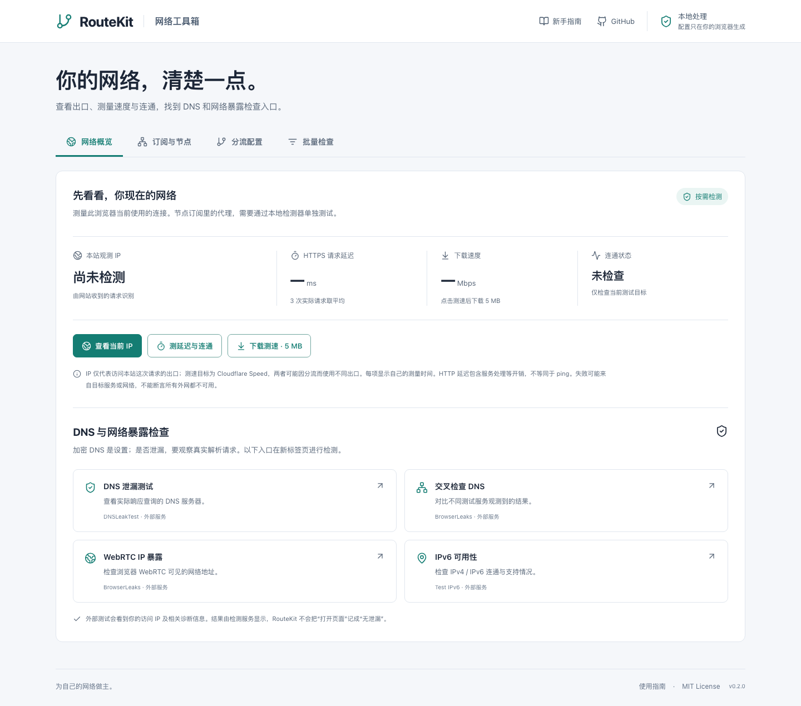

# RouteKit 网络工具箱

[在线使用](https://routekit.menghuaban520.workers.dev) · [GitHub 源码](https://github.com/menghuaban520/routekit)

面向 Shadowrocket 用户的开源网络工具箱：网络概览、订阅与节点、分流配置、批量规则检查。支持新手界面与高级编辑，生成可下载的 `.conf`。

React + TypeScript + Vite，搭配一个只返回当前请求 IP 信息的 Cloudflare Worker。MIT 开源；推荐 Workers 部署，纯静态 Pages 也可使用配置与订阅整理功能。



## 能做什么

- 网络概览：按需查看当前浏览器出口 IP、粗略位置、ASN，执行三次 HTTPS 延迟检查与 5 MB 下载测速。
- DNS 与暴露检查：整合 DNSLeakTest、BrowserLeaks DNS / WebRTC 和 Test IPv6 的真实测试入口；结果在外部服务显示。
- 订阅整理：直接从支持 CORS 的 HTTPS 订阅地址读取，或粘贴、导入文件；支持常见节点 URI 与 Base64 列表、去重、搜索、筛选和导出。
- 订阅用量：读取可见的 `Subscription-Userinfo` 响应头，显示上传、下载、已用、额度、剩余与到期时间；缺失字段显示未知。支持手动导入订阅商提供的头信息，标明数据来源。
- 节点实测：下载检测任务，用可选本地检测器与自己的 Mihomo 内核逐个检测，再导入结果查看入口 IP、实际出口、位置、延迟与速度，按延迟/速度排序，估算地理直线距离。[检测器说明](docs/probe.md)
- 批量分流：按当前实际导出规则匹配域名和 IPv4 / IPv6，支持手动 IP、地区提示与 CSV 下载；无法确定的结果明确标注。

- 新手模式：选择常用应用，设置直连、代理或拦截；例如为酷狗添加域名分流。
- 自定义应用：添加自己需要的域名，不必等待内置目录更新。
- 高级模式：编辑规则、DNS 和兜底策略，实时查看生成结果。
- 本地保存：点击“保存到本地”后保留方案，从“本地方案”重新打开；也可导出配置和可继续编辑的 JSON 方案备份。
- 下载 Shadowrocket `.conf`，再在客户端中导入并选用已有节点。

应用分流使用域名规则，不能识别设备上某个应用的所有进程流量。应用域名可能变化、遗漏或与其他服务共用，内置目录是可编辑的起点。

## 客户端范围

| 客户端 / 格式        | 当前范围                                         |
| -------------------- | ------------------------------------------------ |
| Shadowrocket `.conf` | 首版导出目标，配置分流与 DNS，使用客户端已有节点 |
| Clash / Mihomo YAML  | 后续适配方向，当前不能导出                       |
| v2rayN / Xray        | 后续适配方向，当前不能导出                       |

Shadowsocks 是代理协议；Shadowrocket、Clash 系客户端和 v2rayN 有不同的配置格式。后续适配应复用同一份规则数据，通过各自的导出器生成配置，不能只改文件扩展名。

“链式代理”页提供新手教程：分别验证前置与出口节点，在小火箭中编辑出口节点，为“代理通过 / Proxy Pass”选择前置节点，再启用分流配置并验证出口。界面名称和支持情况依客户端版本而异；网页不会建立节点链路，导出的 `.conf` 只包含分流与 DNS 设置。

## 从生成到使用

1. 选择国内 IP 与其他流量的默认去向，再为常用应用设置直连、代理或拦截。直连使用当前所在地网络，并不自动获得中国大陆出口。
2. 下载 `.conf`，在 Shadowrocket 的“配置”页导入本地文件，或通过系统文件分享菜单交给客户端。实际入口可能随版本变化。
3. 启用导入的配置，将全局路由设为“配置”，选择自己的可用节点后连接。
4. 在设备上验证应用访问、出口 IP 与 DNS；需要链式代理时按网页教程在客户端另外设置。

“保存到本地”最多保留 20 个方案，同名保存会更新原方案。编辑不会自动保存；“导出方案备份”得到可再次编辑的 JSON，导入仅支持 RouteKit JSON 备份，暂不反向解析任意 `.conf`。

## 隐私和 DNS

配置编辑、订阅解析和文件生成在浏览器内完成，无账号或统计脚本。RouteKit 后端不接收节点密码、订阅 URL 或配置。订阅读取由浏览器直接请求你输入的订阅商地址；跨域不允许时，使用粘贴或文件导入，不转交公共转换服务。已保存的方案属于当前浏览器、当前网站地址，清除站点数据或切换部署地址后不会自动迁移，建议另存 JSON 方案备份。

加密 DNS 是配置选项，不是“已测得没有 DNS 泄漏”。实际解析路径受客户端版本、系统、节点、网络和应用影响。导入后仍需在目标设备核对连接与解析结果；本站提供外部真实泄漏检查入口，不会因为启用了加密 DNS 或打开测试页就显示“无泄漏”，也不代理访问流量。

节点信息不自动保存；导出节点或本地检测任务会包含连接凭证，请作为私人文件保存。订阅用量是订阅商提供的快照，不是网页实时计费；本站不自行累计或改写套餐用量；测速经过代理时可能消耗套餐流量，用量以服务商快照为准。浏览器受 CORS 和网络权限限制，不能直接为任意 SS / VLESS 节点做 TCP、UDP 或代理握手，必须使用本地检测器。

查看当前 IP 会请求本网站的 Cloudflare API；延迟和下载测速会请求 Cloudflare Speed。外部检测服务会收到你的访问 IP。IP 位置是粗略数据库信息，住宅/机房/VPN 属性没有数据时显示未知，距离估算不是网络路径或延迟预测。

静态托管服务仍会接收网页资源请求等正常访问元数据。部署者若自行加入统计、第三方资源或后端，需同步更新隐私说明和响应头。

## 格式依据与核验范围

基础配置段和字段曾对照官方 Shadowrocket 2.2.92（3445）应用内置的 `default.conf` 核对，包括 `[General]`、`[Rule]`、`[Host]`、`PROXY` / `DIRECT` 与 `GEOIP` / `FINAL`。这属于语法依据；生成文件仍需在目标版本中真实导入、连接和验收。

- [Shadowrocket 官方 App Store 页面](https://apps.apple.com/us/app/shadowrocket/id932747118)：规则类型、配置导入、加密 DNS 与多级代理能力。
- [官方发布频道：2.2.62 DNS 说明](https://t.me/s/shadowrocketnews?before=890)：`dns-server` 的代理解析扩展语法。首版不会仅因启用加密 DNS 就假定解析已经通过代理。
- [官方发布频道：节点域名 DNS 说明](https://t.me/s/shadowrocketnews?after=930)：节点域名解析有独立设置，解释了为何加密 DNS 开关不能证明所有解析均无泄漏。

订阅用量字段采用 [Mihomo 的解析约定](https://github.com/MetaCubeX/mihomo/blob/Meta/adapter/provider/subscription_info.go)，并非标准 HTTP 字段。跨域读取用量，服务端除 `Access-Control-Allow-Origin` 外，还需允许浏览器读取 `Subscription-Userinfo`：[MDN 响应头暴露说明](https://developer.mozilla.org/en-US/docs/Web/HTTP/Reference/Headers/Access-Control-Expose-Headers)。节点 URI 导入不等同于支持所有客户端配置文件；当前不解析 Clash YAML 或任意 `.conf`。

## 本地开发

建议使用 Node.js 24 和 npm。

```sh
npm ci
npm run dev
```

按终端显示的本地地址打开网页。

```sh
npm run check
npx playwright install chromium
npm run test:e2e
python3 -m unittest discover -s tests/python
```

`check` 依次运行 TypeScript 检查、Vitest 和生产构建；浏览器测试另行运行。静态站点位于 `dist/`，Worker 入口是 `src/worker.ts`。`npm run dev` 仅预览前端；查看 IP 需已部署的 Worker，本地模拟地理数据不会作为真实结果显示。这些检查不能替代 Shadowrocket 真机导入、网络连通性与 DNS 验收。

## 部署与贡献

[Cloudflare 部署说明](docs/deployment.md) 提供 Workers 和 Pages 两条部署路径。仓库包含托管配置与 GitHub Actions 检查流程。官方演示站使用 Cloudflare Workers + 静态资源托管；验收范围见[验证记录](docs/verification.md)。

欢迎按 [贡献指南](CONTRIBUTING.md) 补充应用域名、改进无障碍体验与实现新的客户端适配。代码使用 [MIT License](LICENSE)。
